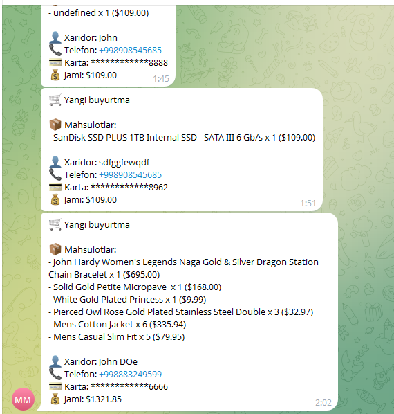
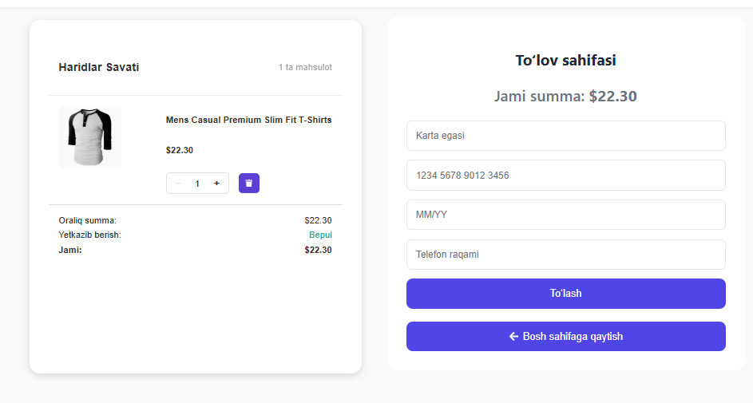
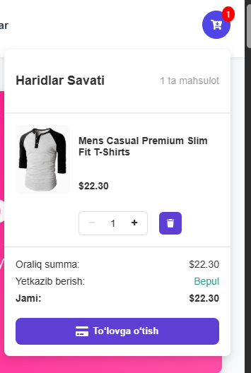

# Mini Marketplace

## 👤 Muallif

**Ism:** Numonov Islomjon

## ⏱ Vazifa uchun ketgan vaqt

**Vaqt:** 8 soat

## ⚠️ Qiyin bo‘lgan joylar

* **Kartalar formati bilan ishlash** – oldin to‘lov tizimini optimallashtirmagan edim.
* **Backend o‘rniga Telegram bot** – to‘lov amalga oshirilganda ma’lumotlar bot orqali guruhga yuboriladi. Backend o'rniga telegramga yubordim malumotlarni.
* **Backend API yo‘qligi** – tekin API’dan foydalanildi. JSON API yaratish mumkin edi, lekin hozircha **FREE API** tanlandim.
* **Route va ScrollToHash** – SPA’da sahifalar o‘rtasida silliq harakatni ta’minlash uchun ishlatildi. SPA da ScrollToHashni qo'llash to'g'ri yo'l edi lekin men payments page qo'shganligim tufayli biroz chalkashliklar yuzaga keldi. Yani payments pageda navbar ishlamdi. lekin bu muammoni hal qildim va bu men uchun yangi tajriba bo'ldi.

## 🛠 Texnologiyalar

* React 19
* Vite
* React Router DOM v7
* React Icons
* AOS (Animation On Scroll)
* Telegram Bot (Payment notify)

## ✨ Loyihaning xususiyatlari

* SPA (Single Page Application)
* Mahsulotlar ro‘yxati
* Trending Gadgets slider
* Savat (Cart)
* To‘lov sahifasi (Telegram bot orqali notify)
* Testimonial slider
* Hamkorlar (Partners) slider
* Responsive dizayn (mobil optimizatsiya)

## 🖼 Interfeys skrinshotlari

* 
* 
* 

## 🚀 Demo

🔗 **Demo havolasi:** [https://github.com/numonofcv/mini-marketplace-for-intern](https://github.com/numonofcv/mini-marketplace-for-intern)

## 📥 Loyihani ishga tushirish

### 1. Loyihani klonlash

```bash
git clone https://github.com/numonofcv/mini-marketplace-for-intern.git
cd mini-marketplace-for-intern
```

### 2. Paketlarni o‘rnatish

```bash
yarn install
# yoki
npm install
```

### 3. Ishga tushirish

```bash
yarn dev
# yoki
npm run dev
```

## 💳 To‘lov tizimi haqida

* Karta raqami **UZCARD, HUMO, VISA, MASTERCARD** formatlariga mos bo‘lishi kerak
* **CVV** faqat VISA va MASTERCARD uchun tekshiriladi
* Telefon raqami **+998** xalqaro formatda bo‘lishi shart
* To‘lov amalga oshirilganda Telegram bot orqali guruhga buyurtma ma’lumotlari yuboriladi

## 📂 Struktura va qo‘shimcha eslatmalar

* Frontend qismi to‘liq tayyor
* Backend mavjud emas (faqat Telegram bot notify funksiyasi bor)
* ScrollToHash orqali sahifada silliq skroll ishlaydi
* Loyihani kengaytirish uchun alohida backend API yozish mumkin

---

📌 **Repository:** [https://github.com/numonofcv/mini-marketplace-for-intern](https://github.com/numonofcv/mini-marketplace-for-intern)

#mini-marketplace-for-intern
